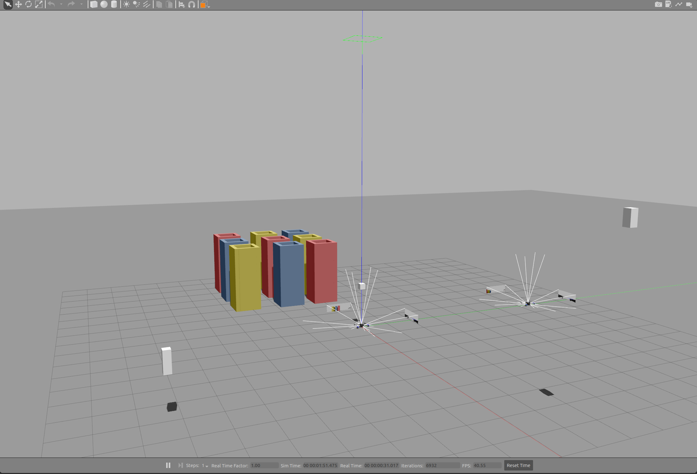
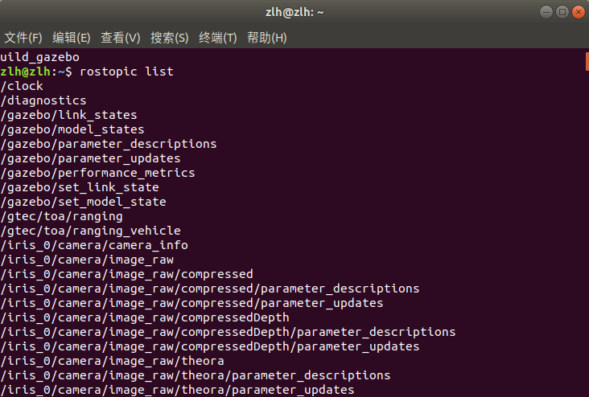
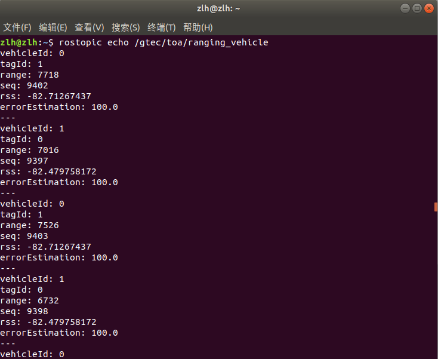

<div id="sidebar"><a href="./README_gitee.md" target="_blank"><font color=#0000FF size=5px >[点我切换gitee版本]<font></center><a></div>


# 目录
- [XTDrone](#xtdrone)
- [USTB ME 814修改版本](#ustb-me-814修改版本)
	- [安装教程](#安装教程)
		- [一、依赖安装](#一依赖安装)
		- [二、ROS安装](#二ros安装)
		- [三、Gazebo安装](#三gazebo安装)
			- [首先装依赖](#首先装依赖)
			- [**Gazebo安装**(以下内容同与上面的链接相同，以应对Gazebo官网打不开的情况)](#gazebo安装以下内容同与上面的链接相同以应对gazebo官网打不开的情况)
				- [1. Setup your computer to accept software from packages.osrfoundation.org.](#1-setup-your-computer-to-accept-software-from-packagesosrfoundationorg)
				- [2. Setup keys](#2-setup-keys)
				- [3. Install Gazebo.](#3-install-gazebo)
				- [4. Check your installation](#4-check-your-installation)
			- [安装ROS插件](#安装ros插件)
		- [四、MAVROS安装](#四mavros安装)
		- [五、PX4配置](#五px4配置)
			- [1.下载\&编译](#1下载编译)
			- [2.添加环境变量](#2添加环境变量)
			- [3.安装地面站QGroundControl](#3安装地面站qgroundcontrol)
			- [QGroundControl安装(同上面的链接，以应对打不开的情况)](#qgroundcontrol安装同上面的链接以应对打不开的情况)
		- [六、XTDrone源码下载(USTB ME 814版本)](#六xtdrone源码下载ustb-me-814版本)
		- [七、UWB插件安装](#七uwb插件安装)
		- [八、试运行](#八试运行)
	- [单目摄像头与UWB配置说明](#单目摄像头与uwb配置说明)
		- [一、摄像头](#一摄像头)
			- [单目摄像头的sdf标签解释](#单目摄像头的sdf标签解释)
		- [二、UWB](#二uwb)
			- [依赖](#依赖)
			- [使用方法](#使用方法)
				- [标签解释](#标签解释)
			- [发布的话题](#发布的话题)


# XTDrone
[项目源地址](https://github.com/robin-shaun/XTDrone)

[gitee](https://gitee.com/robin_shaun/XTDrone)

[XTDrone使用文档](https://www.yuque.com/xtdrone/manual_cn)


# USTB ME 814修改版本
**环境**：
* Ubuntu 18.04 LTS
* ROS Melodic

修改了**旋翼键盘控制程序**描述问题，以及**固定翼**在未给航点情况下弹出警告的问题  ~~小问题可以不改~~

该版本在XTDrone基础上,添加了
  * 给*Gazebo*添加了更改后的`UWB`插件([原版本](https://github.com/valentinbarral/gazebosensorplugins))
  * 带`单目摄像头`和`UWB`的**旋翼**与**固定翼**模型

话不多说，这就来装
## 安装教程
主要参考 **[XTDrone使用文档](https://www.yuque.com/xtdrone/manual_cn)**，出问题了可以回到原文档看看`PX4 1.13版本
安装教程`

注：安装默认在**根目录`~/`**，若安装在**其他地方**后续指令要作相应的更改

报错请**百度**或参考**原文档**

### 一、依赖安装
打开终端(Ctrl + T)，在终端中粘贴(Ctrl + Shift + V)下列指令，回车进行安装

```
sudo apt install ninja-build exiftool ninja-build protobuf-compiler libeigen3-dev genromfs xmlstarlet libgstreamer1.0-dev libgstreamer-plugins-base1.0-dev python-pip python3-pip gawk
```
```
pip2 install pandas jinja2 pyserial cerberus pyulog==0.7.0 numpy toml pyquaternion empy pyyaml 
pip3 install packaging numpy empy toml pyyaml jinja2 pyargparse kconfiglib jsonschema future
```
### 二、ROS安装
安装**Ubuntu**对应**ROS**版本即可

网上的方法很多，推荐先参照[ROS官方](http://wiki.ros.org/melodic/Installation/Ubuntu)(Melodic)

出现问题利用好**搜索工具**，ROS安装问题以及解决方法网上有很多 ~~开始受苦~~

>* 当你的**小海龟**动起来后，恭喜你，**ROS**安装成功

让我们来创建一个**ROS**工作空间**xtdrone_ws**，并初始化，为后面做准备

打开一个新终端
```
mkdir -p ~/xtdrone_ws/src
cd ~/xtdrone_ws/src
catkin_init_workspace
```
### 三、Gazebo安装
Gazebo包括Gazebo本身和ROS的插件，需要分别安装。首先卸载之前的Gazebo
```
sudo apt-get remove gazebo* 
sudo apt-get remove libgazebo*
sudo apt-get remove ros-melodic-gazebo* 
```
XTDrone对Gazebo的ROS插件做了修改，因此需要源码编译。

#### 首先装依赖
```
sudo apt-get install ros-melodic-moveit-msgs ros-melodic-object-recognition-msgs ros-melodic-octomap-msgs ros-melodic-camera-info-manager  ros-melodic-control-toolbox ros-melodic-polled-camera ros-melodic-controller-manager ros-melodic-transmission-interface ros-melodic-joint-limits-interface
```
**然后安装[*Gazebo*](https://classic.gazebosim.org/tutorials?tut=install_ubuntu&cat=install)**(Alternative installation: step-by-step的安装方式)

> **注意**：
>1. 如果安装有依赖问题，可以使用`sudo aptitude install gazebo11`，选择合理的依赖解决办法(别删ROS)
>2. 按步骤装完Gazebo后，升级所有的包 sudo apt upgrade，这样能保证gazebo所有依赖版本一致

___
#### **Gazebo安装**(以下内容同与上面的链接相同，以应对Gazebo官网打不开的情况)

##### 1. Setup your computer to accept software from packages.osrfoundation.org.
```
sudo sh -c 'echo "deb http://packages.osrfoundation.org/gazebo/ubuntu-stable `lsb_release -cs` main" > /etc/apt/sources.list.d/gazebo-stable.list'
```
You can check to see if the file was written correctly. For example, in Ubuntu Bionic (18.04), you can type:
```
cat /etc/apt/sources.list.d/gazebo-stable.list
```
And if everything is correct, you should see:
```
deb http://packages.osrfoundation.org/gazebo/ubuntu-stable bionic main
```
##### 2. Setup keys
```
wget https://packages.osrfoundation.org/gazebo.key -O - | sudo apt-key add -
```
##### 3. Install Gazebo.
First update the debian database:
```
sudo apt-get update
```
Hint: make sure the apt-get update process ends without any errors, the console output ends in `Done` similar to below:
```
$ sudo apt-get update
...
Hit http://ppa.launchpad.net bionic/main Translation-en
Ign http://us.archive.ubuntu.com bionic/main Translation-en_US
Ign http://us.archive.ubuntu.com bionic/multiverse Translation-en_US
Ign http://us.archive.ubuntu.com bionic/restricted Translation-en_US
Ign http://us.archive.ubuntu.com bionic/universe Translation-en_US
Reading package lists... Done
```
Next install gazebo-11 by:
```
sudo apt-get install gazebo11
# For developers that work on top of Gazebo, one extra package
sudo apt-get install libgazebo11-dev
```
##### 4. Check your installation
```
gazebo
```
___

#### 安装ROS插件
**XTDrone**对Gazebo的ROS插件做了修改，因此需要源码编译。

首先装依赖
```
sudo apt-get install ros-melodic-moveit-msgs ros-melodic-object-recognition-msgs ros-melodic-octomap-msgs ros-melodic-camera-info-manager  ros-melodic-control-toolbox ros-melodic-polled-camera ros-melodic-controller-manager ros-melodic-transmission-interface ros-melodic-joint-limits-interface
```
然后克隆并编译Gazebo的插件gazebo_ros_pkgs，放在`~/xtdrone_ws/src`下（如果编译时还缺其他的依赖，同上方法安装）
```
cd ~/xtdrone_ws/src
git clone -b melodic-devel https://github.com/ros-simulation/gazebo_ros_pkgs.git
cd ..
catkin_make
```
编译成功后在两个终端分别执行如下两条指令，判断gazebo_ros是否安装成功
```
roscore 
```
```
source ~/xtdrone_ws/devel/setup.bash
rosrun gazebo_ros gazebo
```
Gazebo有很多开源的模型文件，一些需要的模型文件上传到了附件中，供下载：

--> 请点击[📎models.zip](https://www.yuque.com/attachments/yuque/0/2022/zip/985678/1670494695523-2a18624d-545e-4552-a3b1-714ac5d649c2.zip)

将该附件解压缩后放在`~/.gazebo`中，此时在`~/.gazebo/models/`路径下可以看到很多模型。如果不做这一步，之后运行Gazebo仿真，可能会缺模型，这时会自动下载，Gazebo模型服务器在国外，自动下载会比较久
___

### 四、MAVROS安装
注意，mavros-extras一定别忘记装，否则视觉定位将无法完成
```
sudo apt install ros-melodic-mavros ros-melodic-mavros-extras 
wget https://gitee.com/robin_shaun/XTDrone/raw/master/sitl_config/mavros/install_geographiclib_datasets.sh

sudo chmod a+x ./install_geographiclib_datasets.sh
sudo ./install_geographiclib_datasets.sh #这步需要装一段时间
```
___
### 五、PX4配置
#### 1.下载&编译
___
以下给出推荐配置,更多PX4仿真配置,见[PX4仿真文档](https://dev.px4.io/master/en/simulation/)

可以直接下载XTDrone的压缩包[📎PX4_Firmware.zip](https://www.yuque.com/attachments/yuque/0/2022/zip/985678/1672148620266-ad2f680e-e9ec-4be0-9746-914552829832.zip)，解压后记得删除原有的`build`文件再进行编译

或者下我上传的这个已经删掉`build`文件的版本[百度网盘](https://pan.baidu.com/s/1XRU6vh-qW9wsJsrRf4U3oA?pwd=2233)
___
下载好后，解压放在` ～/`目录下(打开终端，输入`pwd`，显示的就是` ～/`目录)

打开终端，进入文件夹进行编译
```
cd PX4_Firmware
make px4_sitl_default gazebo
```
编译完成后，会弹出Gazebo界面，将其关闭即可
#### 2.添加环境变量
修改 ~/.bashrc
```
gedit .bashrc
```
在**文档最后**加入以下代码，注意路径匹配，前两个source顺序不能颠倒，一个是**工作空间**，一个是**PX4**
```
source ~/catkin_ws/devel/setup.bash
source ~/PX4_Firmware/Tools/setup_gazebo.bash ~/PX4_Firmware/ ~/PX4_Firmware/build/px4_sitl_default
export ROS_PACKAGE_PATH=$ROS_PACKAGE_PATH:~/PX4_Firmware
export ROS_PACKAGE_PATH=$ROS_PACKAGE_PATH:~/PX4_Firmware/Tools/sitl_gazebo
```
再运行：
```
source ~/.bashrc
```
然后运行如下命令，此时会启动Gazebo，会有相应界面显示

并在新终端执行
```
rostopic echo /mavros/state
```
若connected: True,则说明MAVROS与SITL通信成功

如果是false，一般是因为.bashrc里的路径写的不对，请仔细检查
```
---
header:
seq: 11
stamp:
secs: 1827
nsecs: 173000000
frame_id: ''
connected: True
armed: False
guided: False
manual_input: True
mode: "MANUAL"
system_status: 3
---
```

**(实际这里暂不影响目前的功能使用，可先跳过，后续走不通再回来检查)**
#### 3.安装地面站QGroundControl
* 点此[安装链接](https://docs.qgroundcontrol.com/en/getting_started/download_and_install.html)
* 后续**固定翼**要打开地面站，通讯正常连接的情况下才能起飞
___
#### QGroundControl安装(同上面的链接，以应对打不开的情况)
**Ubuntu Linux**

_QGroundControl_ can be installed/run on Ubuntu LTS 20.04 (and later).

Ubuntu comes with a serial modem manager that interferes with any robotics related use of a serial port (or USB serial). Before installing _QGroundControl_ you should remove the modem manager and grant yourself permissions to access the serial port. You also need to install _GStreamer_ in order to support video streaming.

Before installing _QGroundControl_ for the first time:

1.  On the command prompt enter:
    
    ```
    sudo usermod -a -G dialout $USER
    sudo apt-get remove modemmanager -y
    sudo apt install gstreamer1.0-plugins-bad gstreamer1.0-libav gstreamer1.0-gl -y
    sudo apt install libqt5gui5 -y
    sudo apt install libfuse2 -y
    ```
    
2.  Logout and login again to enable the change to user permissions.

To install _QGroundControl_:

1.  Download [QGroundControl.AppImage](https://d176tv9ibo4jno.cloudfront.net/latest/QGroundControl.AppImage).(备用:[百度网盘]())
2.  Install (and run) using the terminal commands:
	```
	chmod +x ./QGroundControl.AppImage
	./QGroundControl.AppImage  (or double click)
	```

___
### 六、XTDrone源码下载(USTB ME 814版本)
 1. 打开一个新终端
 
	```
	git clone -b ustb-demo https://github.com/IndexMark/XTDrone.git
	cd XTDrone
	git submodule update --init --recursive
	# 修改启动脚本文件
	cp sitl_config/init.d-posix/* ~/PX4_Firmware/ROMFS/px4fmu_common/init.d-posix/
	# 添加launch文件
	cp -r sitl_config/launch/* ~/PX4_Firmware/launch/
	# 添加世界文件
	cp sitl_config/worlds/* ~/PX4_Firmware/Tools/sitl_gazebo/worlds/
	# 修改部分模型文件
	cp -r sitl_config/models/* ~/PX4_Firmware/Tools/sitl_gazebo/models/ 
	# 替换同名文件
	cd ~/.gazebo/models/
	rm -r stereo_camera/ 3d_lidar/ 3d_gpu_lidar/ hokuyo_lidar/
	```
因为Gazebo寻找模型的顺序，是先在`~/.gazebo/models/`下寻找，然后在其他路径寻找，所以在往PX4 SITL复制models时，要注意`~/.gazebo/models/`下有没有同名文件（比如`~/.gazebo/models/`下默认有stereo_camera），有的话要么将该同名文件删去，要么替换该同名文件。

如果在仿真过程中出现了某个部件为白色方块的情况，大概率是因为`~/.gazebo/models/`下有和`PX4_Firmware/Tools/sitl_gazebo/models`重复的模型，此时删掉`~/.gazebo/models/`下的模型文件即可

* 这一步添加了带**多个单目摄像头**以及**UWB**的模型.sdf文件，以及一个带9个彩墙的世界

 2. 打开一个新终端，重新编译PX4固件
	```
	cd ~/PX4_Firmware
	make px4_sitl_default gazebo
	```
编译好后会出现Gazebo界面，关闭即可

___
### 七、UWB插件安装
打开一个新的终端，安装**UWB功能包**以及对应的**自定义消息**

(进入`xtdrone_ws/src`文件夹)

```
cd ~/xtdrone_ws/src
git clone -b ustb-demo https://github.com/IndexMark/gazebosensorplugins.git
git clone -b ustb-demo https://github.com/IndexMark/gtec_rosmsgs.git
cd ..
catkin_make
```
___
### 八、试运行
1. 打开一个终端，启动仿真环境
	```
	roslaunch px4 rby_wall.launch
	```
	打开*Gazebo*后，可以见到几面彩墙

	用**鼠标滚轮**进行缩放，便能看见2个带**多个单目摄像头视觉**的Iris旋翼无人机，还有3个**UWB**用的**锚点**
	
	 


	打开一个终端，查看ROS话题列表
	```
	rostopic list
	```
	
		
	
	* `/gtec/toa/ranging`为**标签**到各个**锚点**的距离
	* `/gtec/toa/ranging_vehicle`为**标签**到**无人机**的距离，(标签在载具中心的情况下，可认为是标签之间的距离)
	
	打开两个终端，分别查看具体的话题消息
	```
	rostopic echo /gtec/toa/ranging
	```
	```
	rostopic echo /gtec/toa/ranging_vehicle
	```
	
	

2. 用键盘控制无人机飞行

	在一个终端运行
	```
	cd ~/PX4_Firmware
	roslaunch px4 indoor1.launch
	```
-   注意，用ctrl+c关闭仿真进程，有可能没有把Gazebo的相关进程关干净，这样再启动仿真时可能会报错
-  可以先关闭Gazebo，再ctrl+c关闭终端进程
- 如果出现这种情况，可以用killall -9 gzclient，killall -9 gzserver 这两个命令强行关闭gazebo所有进程。

	Gazebo启动后，在另一个终端运行（注意要等Gazebo完全启动完成，或者可能脚本会报错）
	```
	cd ~/XTDrone/communication/
	python multirotor_communication.py iris 0
	```
	与0号iris建立通信后，在另一个终端运行
	```
	cd ~/XTDrone/control/keyboard
	python multirotor_keyboard_control.py iris 1 vel
	```
	便可以通过键盘控制1架iris的解锁/上锁(arm/disarm)，修改飞行模式，飞机速度等。使用v起飞利用的是takeoff飞行模式，相关参数（起飞速度、高度）要在rcS中设置。一般可以使用offboard模式起飞，这时起飞速度要大于0.3m/s才能起飞(即：upward velocity 需要大于0.3)。注意，飞机要先解锁才能起飞！飞到一定高度后可以切换为‘hover’模式悬停，再运行自己的飞行脚本，或利用键盘控制飞机。

推荐起飞流程，按i把向上速度加到0.3以上，再按b切offboard模式，最后按t解锁。

注意，现在mavros话题与服务前带有了无人机名字，如：/iris_0/mavros/state

3. 仿真器基础特性说明

	-   仿真是可以暂停的，如下面的视频所示，点Gazebo的暂停键

		此处为语雀视频卡片，点击链接查看：[仿真过程可以暂停.mp4](https://www.yuque.com/xtdrone/manual_cn/basic_config_13#HGbpx)

	-   Gazebo最下面一行的real time factor是指仿真时间与真实时间的比值，通常是1，越小说明仿真越慢。通常情况下，随着仿真的进行，CPU占有率会变高，real time factor会缓慢下降，下降情况与电脑性能有关。FPS是指仿真器渲染的帧率，与显卡性能密切相关，这个值不能过低，否则不能满足视觉算法的需求，很多情况下FPS过低是显卡驱动安装存在问题导致。

	-   Gazebo的world文件越复杂，加载时间越长，有时一直加载不出来，是因为本地路径缺少了world文件中所需的一些model文件。

	-   Gazebo中可以用鼠标拖动物体移动，但这种操作不适用于无人机，因为会导致PX4的状态估计出错，更多有关“瞬移”无人机可见[https://www.yuque.com/xtdrone/manual_cn/accelerate_sim_and_large_swarm](https://www.yuque.com/xtdrone/manual_cn/accelerate_sim_and_large_swarm)

	  

	-   有时启动Gazebo会出现奇怪的问题，这时可以通过killall -9 gzclient 和killall -9 gzserver彻底关闭Gazebo，再启动roslaunch尝试解决，或通过重启电脑或docker尝试解决。

	  

	-   由于不同版本的Gazebo对光照的设置不同，因此有些场景在一些版本中光照可能不合适，您可以手动调整删除一些光照源。

	-   所有以indoor开头的场景，都有一个不可见的天花板，它具有碰撞属性，因此无人机不能飞出室内，更多关于天花板的知识见[此文档](https://www.yuque.com/xtdrone/manual_cn/building_editor#nNdW8)。

到此，仿真平台基础配置完成！
___
## 单目摄像头与UWB配置说明

- **强烈建议**先熟悉和参考XTDrone官方文档中[不同无人机的配置与控制](https://www.yuque.com/xtdrone/manual_cn/vehicle_config)，看完再进行下面的配置

### 一、摄像头

- 单目摄像头的原始 **.sdf** 与可以在`~/PX4_Firmware/Tools/stil_gazebo/models/monocular_camera`目录下找到

- 模型含有单个单目摄像头的情况下，可直接在模型的 **.sdf**文件里直接引用，添加关节joint

	```
	<include>
	      <uri>model://monocular_camera</uri>
	      <pose>0 0 -0.05 0 0.5 0</pose>
	</include>
	    <joint name="monocular_down_joint" type="fixed">
	      <child>monocular_camera::link</child>
	      <parent>base_link</parent>
	      <axis>
	        <xyz>0 0 1</xyz>
	        <limit>
	          <upper>0</upper>
	          <lower>0</lower>
	        </limit>
	      </axis>
	    </joint>
	```
但针对**多个单目摄像头**的情况，如果直接引用多个摄像头，会导致**多个摄像头名称相同**，从而发布的**话题名相同**产生**冲突**

因此需要在模型的 **.sdf**文件中复制多个**单目摄像头原始文件**`monocular_camera.sdf`的原始代码，并进行相应的编号

* 例：对于`camera N `(**N**代表摄像头的**编号**)

	```
	<!-- For Camera N -->
		<model name='monocular_cameraN'>
		    <pose>0 0 -0.05 0 1.57079632679 0</pose>
		      <link name='link'>
			<inertial>
			  <mass>0.001</mass>
			  <inertia>
			  <ixx>4.15e-6</ixx>
			  <ixy>0</ixy>
			  <ixz>0</ixz>
			  <iyy>2.407e-6</iyy>
			  <iyz>0</iyz>
			  <izz>2.407e-6</izz>
			  </inertia>
			</inertial>
			<visual name='visual'>
			  <geometry>
			    <box>
			      <size>0.01 0.01 0.01</size>
			    </box>
			  </geometry>
			</visual>
			<sensor name='camera' type='camera'>
			  <camera name='__default__'>
			    <horizontal_fov>2.0944</horizontal_fov>
			    <image>
			      <width>720</width>
			      <height>480</height>
			    </image>
			    <clip>
			      <near>0.01</near>
			      <far>150</far>
			    </clip>
			    <noise>
			      <type>gaussian</type>
			      <mean>0.0</mean>
			      <stddev>0.001</stddev>
			    </noise>
			    <lens>
			      <type>custom</type>
			      <custom_function>
			        <c1>1.05</c1>
			        <c2>4</c2>
			        <f>1</f>
			        <fun>tan</fun>
			      </custom_function>
			      <scale_to_hfov>1</scale_to_hfov>
			      <cutoff_angle>3.1415</cutoff_angle>
			    </lens>
			  </camera>
			  <always_on>1</always_on>
			  <update_rate>30</update_rate>
			  <visualize>1</visualize>
			  <plugin name='camera_plugin' filename='libgazebo_ros_camera.so'>
			      <robotNamespace></robotNamespace>
			      <alwaysOn>true</alwaysOn>
			      <imageTopicName>image_raw</imageTopicName>
			      <cameraInfoTopicName>camera_info</cameraInfoTopicName>
			      <updateRate>30.0</updateRate>
			      <cameraName>cameraN</cameraName>
			      <frameName>/camera_link</frameName>
			      <CxPrime>640</CxPrime>
			      <Cx>640</Cx>
			      <Cy>360</Cy>
			      <hackBaseline>0</hackBaseline>
			      <focalLength>369.502083</focalLength>
			      <distortionK1>0.0</distortionK1>
			      <distortionK2>0.0</distortionK2>
			      <distortionK3>0.0</distortionK3>
			      <distortionT1>0.0</distortionT1>
			      <distortionT2>0.0</distortionT2>
			  </plugin>
			</sensor>
			<self_collide>0</self_collide>
			<kinematic>0</kinematic>
		      </link>
		  </model>

	    <joint name="monocular_down_jointN" type="fixed">
	      <child>monocular_cameraN::link</child>
	      <parent>base_link</parent>
	      <axis>
	        <xyz>0 0 1</xyz>
	        <limit>
	          <upper>0</upper>
	          <lower>0</lower>
	        </limit>
	      </axis>
	    </joint>

	```

	太长不看？来个**简洁版本**：

	```
	<!-- For Camera N -->
	
		<model name='monocular_cameraN'>
		
		    <pose>0 0 -0.05 0 1.57079632679 0</pose>
		      <link name='link'>
			……
			  <plugin name='camera_plugin' filename='libgazebo_ros_camera.so'>
			      ……
			      <updateRate>30.0</updateRate>
			      
			      <cameraName>cameraN</cameraName>
			      
			      <frameName>/camera_link</frameName>
			      ……
			  ……
			<kinematic>0</kinematic>
		      </link>
		  </model>

	    <joint name="monocular_down_jointN" type="fixed">
	      <child>monocular_cameraN::link</child>
	      
	      ……
	    </joint>

	```
	主要对**四个标签**进行编号即可
	```
	1.<model name='monocular_cameraN'>

	2.<cameraName>cameraN</cameraName>

	3.<joint name="monocular_down_jointN" type="fixed">

	4.<child>monocular_cameraN::link</child>
	```
* 修改完模型 **.sdf**文件后，也要修改同文件夹下的**model.config**文件：
	* \<model>下的\<name>要对应 **.sdf**文件的名字
	* \<sdf version>要与 **.sdf**文件中的对应，名称也一样
	* 作者与描述不影响使用

---

#### 单目摄像头的sdf标签解释

参考->[知乎](https://zhuanlan.zhihu.com/p/437704085)

可与**上方详细版本**对照查看￪

---

**\<camera>** 主标签

专门用于定义相机传感器，该元素具有**1个属性**和**10个子元素**

 **属性 name** (可选)

用于指定该相机的可选名称，数据类型为string，默认值为"default"

**子元素：**

1. **\<**horizontal_fov**>**(**必选**)

	用于指定**水平视场角（视野）**，数据类型为double，默认值为1.0469
	
2. **\<**image**>** (**必选**)

	用于定义**图像的尺寸**（以像素为单位）和**格式**

	该子元素又具有以下**3个子元素**：

	1. **\<**width**>** (**必选**)

		用于指定图像的宽度（单位为像素），数据类型为int，默认值为320
	
	2. **\<**height**>** (**必选**)

		用于指定图像的高度（单位为像素），数据类型为int，默认值为240

	3. **\<**format**>** (可选)
		
		可选子元素，数据类型为string，默认值为R8G8B8
		该子元素用于指定图像的格式，支持的格式包括L8|L16|R_FLOAT16|R_FLOAT32|R8G8B8|B8G8R8|BAYER_RGGB8|BAYER_BGGR8|BAYER_GBRG8|BAYER_GRBG8

3. **\<**clip**>** (**必选**)

	用于定义相机的**近裁切平面**和**远裁切平面**（比这些平面更近或更远的对象将不会进行渲染）
	该子元素又具有以下**2个子元素**：

	1. **\<**near**>** (**必选**)

		用于定义相机中心点到近裁切平面的距离，数据类型为double，默认值为0.1
	
	2. **\<**far**>** (**必选**)

		用于定义相机中心点到远裁切平面的距离，数据类型为double，默认值为100

4. **\<**save**>**(可选)

	用于设置启用/禁用相机**图像帧的保存**功能。该子元素又具有**1个属性**和**1个子元素**

	1. **属性 enabled** (**必选**)

		用于设置是否启用图像帧保存，数据类型为bool
		默认值为0或false即禁用图像帧保存功能
		如果将此属性值设置为true，则会启用图像帧的保存功能

	2. **\<**path**>**(**必选**)

		用于指定保存图像帧数据的路径名，数据类型为string，默认值为"default"
		如果该路径名是相对的，则目录是相对于当前工作目录的

5. **\<**depth_camera**>**(可选)
	
	用于定义**深度相机**的参数，该子元素又具有以下**2个子元素**：

	1. **\<**output**>**(**必选**)
	
		用于指定输出的类型，数据类型为string，默认值为depths

	2. **\<**clip**>** (可选)

		用于定义相机的**近裁切平面**和**远裁切平面**（比这些平面更近或更远的对象将不会进行渲染）
		该子元素又具有以下**2个子元素**：

		1. **\<**near**>** (**必选**)

			用于定义相机中心点到近裁切平面的距离，数据类型为double，默认值为0.1
	
		2. **\<**far**>** (**必选**)

			用于定义相机中心点到远裁切平面的距离，数据类型为double，默认值为100

6. **\<**noise**>**(可选)
	
	用于定义应该应用于生成图像的**噪声模型**的特征，该子元素又具有以下**3个子元素**：

	1. **\<**tpye**>**(**必选**)
		
		用于指定噪声类型，数据类型为string，默认值为gaussian
		当前支持的噪声类型是：“gaussian”（从高斯分布中为每个像素独立获得附加噪声值）

	2. **\<**mean**>**(可选)

		用于定义噪声的平均值，数据类型为double，默认值为0
		对于“gaussian”噪声类型，此子元素值是从中提取噪声值的高斯分布的平均值

	3. **\<**stddev**>**(可选)

		用于定义噪声的标准差，数据类型为double，默认值为0
		对于“gaussian”噪声类型，此子元素值是从中提取噪声值的高斯分布的标准差

7. **\<**distortion**>**(可选)

	用于定义相机图像的**镜头畸变（失真）**，具体请参见[Wiki](https://en.wikipedia.org/wiki/Distortion_(optics)#Software_correction)
	该子元素具有以下**6个子元素**：

	1. **\<**k1**>**(可选)

		用于指定径向畸变系数k1，数据类型为double，默认值为0

	2. **\<**k2**>**(可选)

		用于指定径向畸变系数k2，数据类型为double，默认值为0

	3. **\<**k3**>**(可选)

		用于指定径向畸变系数k3，数据类型为double，默认值为0

	4. **\<**p1**>**(可选)

		用于指定指定切向畸变系数p1，数据类型为double，默认值为0

	5. **\<**p2**>**(可选)

		用于指定切向畸变系数p2，数据类型为double，默认值为0

	6. **\<**center**>**(可选)

		用于指定畸变中心或主点，数据类型为vector2d，默认值为（0.5 0.5）

8. **\<**lens**>**(可选)

	用于描述**镜头投影**

	该子元素又具有以下**6个子元素**：

	1. **\<**type**>**(**必选**)

		用于指定镜头投影类型，数据类型为string，默认值为stereographic
		支持的镜头投影类型包括gnomonical、stereographic、equidistant、equisolid_angle、orthographic、custom
		对于gnomonical（透视）投影，建议指定一个小于等于90°的horizontal_fov值

	2. **\<**scale_to_hfov**>**(**必选**)

		用于设置是否根据水平FOV进行缩放，数据类型为bool，默认值为1
		如果此子元素值设置为true，则图像将会某个比例因子进行缩放以适合水平FOV，否则将会根据投影类型参数进行显示

	3. **\<**custom_function**>**(可选)

		可选子元素，用于指定自定义映射函数，该函数的定义形式为r=c1*f*fun(theta/c2 + c3)
		详见[Wiki](https://en.wikipedia.org/wiki/Fisheye_lens#Mapping_function)
		该子元素又具有以下**6个子元素**：

		1. **\<**c1**>**(可选)

			用于指定线性缩放比例常数，数据类型为double，默认值为1
		
		2. **\<**c2**>**(可选)

			用于指定角度缩放比例常数，数据类型为double，默认值为1
			
		3. **\<**c3**>**(可选)

			用于指定指定角度偏移常数，数据类型为double，默认值为0
			
		4. **\<**f**>**(可选)

			数据类型为double，默认值为1
			该子元素用于指定光学系统的焦距
			请注意：这不是一般意义上的镜头焦距！
			如果  8.2 **<scale_to_fov>** 子元素值设置为 true，则会忽略此子元素值
			
		5. **\<**fun**>**(**必选**)

			必选子元素，用于指定函数类型，数据类型为string，默认值为tan
			可能的函数类型包括“sin”、“tan”和“id”
	
	4. **\<**cutoff_angle**>**(可选)

		数据类型为double，默认值为1.5707。此子元素指定的角度之外的所有内容都将会被隐藏，默认为 90°（对于弧度为1.5707）

	5. **\<**env_texture_size**>**(可选)

		用于指定绘制仿真世界环境立方体贴图的分辨率，数据类型为int，默认值为256

	6. **\<**intrinsics**>**(可选)
	
		用于设置自定义透视投影矩阵的**相机内在参数**（不能用于WideAngleCamera，因为这种类型的相机使用来自6个不同相机的图像拼接以获得宽视野）
		
		焦距可以用focal_length_in_pixels = (image_width_in_pixels * 0.5) / tan(field_of_view_in_degrees * 0.5 * PI/180) 来进行计算

		该子元素又具有以下**5个子元素**：

		1. **\<**fx**>**(**必选**)

			用于指定X轴的焦距（单位为像素，会覆盖horizontal_fov元素值），数据类型为double，默认值为277

		2. **\<**fy**>**(**必选**)

			用于指定Y轴的焦距（单位为像素，会覆盖horizontal_fov元素值），数据类型为double，默认值为277

		3. **\<**cx**>**(**必选**)

			用于指定X轴的主点（单位为像素），数据类型为double，默认值为160

		4. **\<**cy**>**(**必选**)

			用于指定Y轴的主点（单位为像素），数据类型为double，默认值为120


		1. **\<**s**>**(**必选**)

			用于指定XY轴偏斜，数据类型为double，默认值为0

9. **\<**visibility_mask**>**(可选)

	 数据类型为unsigned int，默认值为4294967295
	 
	 该子元素用于指定相机的可见性掩模
	 
	 当（<camera>元素的<visibility_mask>子元素 & <visual>元素的<visibility_flags>子元素）被评估为非0时，该视觉对相机是可见的

10. **\<**pose**>**(可选)
	
	数据类型为pose，默认值为（0 0 0 0 -0 0），用于指定相对于relative_to属性中命名的坐标系的位置（x,y,z）和方位（横滚角roll, 俯仰角pitch, 偏航角yaw）

	此子元素具有**1个属性**：
	
	**属性relative_to**

	数据类型为string，如果指定此属性的值，则此位姿是在命名坐标系中表示的

	命名坐标系必须在与此标签指定位姿的元素相同作用范围（仿真世界/模型）内声明。如果缺失或未指定，则该位姿是在包含该位姿的元素的父级XML元素的坐标系中表示的。

	有关此规则的例外情况以及有关默认行为的更多详细信息，请参阅 [Wiki](https://link.zhihu.com/?target=http%3A//sdformat.org/tutorials%3Ftut%3Dpose_frame_semantics)

	请注意，属性relative_to仅影响该元素的初始位姿，并不会影响该元素的后续动态运动。v1.8中的新功能：属性relative_to可以使用嵌套范围的坐标系。在这种情况下，会使用 `::` 作为定界符来指定坐标系以定义坐标系的作用范围，例如 `nested_model_A::nested_model_B::awesome_frame`。

---
### 二、UWB

[原版本](https://github.com/valentinbarral/gazebosensorplugins)是基于测试数据得到的结果，这里根据信号的强弱，把误差作线性化处理

#### 依赖
* 库`libignition-math4-dev` 和 `libgazebo9-dev` 
* 自定义消息类型`gtec_msgs`

#### 使用方法
该插件具有三种状态：**LOS**、**NLOS Soft**和**NLOS**

-   **LOS** (Line of Sight): 在这种情况下，***tag*** 和 ***anchor*** 之间没有障碍物且没有信号衰减
-   **NLOS Soft** (Non Line of Sight Soft): 在这种情况下，***tag*** 和 ***anchor*** 之间因有**一个**薄障碍物或信号衰减，导致接收功率低于 LOS 状态
- ~~NLOS Hard (Non Line of Sight Hard): 在这种情况下，tag和anchor之间的障碍物太多，直接信号无法到达接收器。 但在这种情况下，信号在一堵墙内反弹后，有一条从tag到anchor的路径。 因此，估计的距离对应于这条新路径，因此总是比设备之间的实际距离长~~

	原版本的NLOS Hard模式考虑的是在室内小空间里存在信号反射的情况
但目前仿真环境中用于远距离百米级测据，不考虑信号反射的情况，故对这一状态进行了删减

-   **NLOS**（Non Line of Sight）：Tag 和 anchor 距离太远或它们之间有太多障碍物

通过添加下面的代码到模型的 **.sdf**或 **.urdf**文件，把**UWB插件**添加到*Gazebo*对应的模型中

(该仿真环境中，模型文件夹在`~/PX4_Firmware/Tools/sitl_gazebo/models/`)

* 修改完模型 **.sdf**文件后，也要修改同文件夹下的**model.config**文件：
	* \<model>下的\<name>要对应 **.sdf**文件的名字
	* \<sdf version>要与 **.sdf**文件中的对应，名称也一样
	* 作者与描述不影响使用

```
<plugin name='libgtec_uwb_plugin' filename='libgtec_uwb_plugin.so'>
      <update_rate>25</update_rate>
      <nlosSoftWallWidth>3</nlosSoftWallWidth>
      <tag_x_offset>0</tag_x_offset>
      <tag_y_offset>0</tag_y_offset>
      <tag_z_offset>0</tag_z_offset>
      <tag_link>tag_0</tag_link>
      <anchor_prefix>uwb_anchor</anchor_prefix>
      <all_los>false</all_los>
      <tag_id>0</tag_id>
      <maxDBDistance>14</maxDBDistance>
   
      <MaxPosNoise>300</MaxPosNoise>
      <MinPosNoise>100</MinPosNoise>
      <MaxRSS>-80</MaxRSS>
      <MinRSS>-95</MinRSS>
      <MaxDisDecay>5</MaxDisDecay>

	
      
      <vehicle_prefix>iris</vehicle_prefix>
      <PubRangeTopic>true</PubRangeTopic>
      <PubRangeVehicleTopic>true</PubRangeVehicleTopic>

      <NoObstacleRadius>0.236</NoObstacleRadius>
      
</plugin>
```
##### 标签解释

- **\<update_rate>**: 消息频率(每秒发出消息的数量)

- **\<nlosSoftWallWidth>**:  NLOS Soft状态下的障碍物最大厚度，即信号最大穿透障碍物的厚度

- **\<tag_x_offset>**: 标签到无人机原点x方向的距离偏移值 (在标签相互测距模式下偏移值均需置0)

- **\<tag_y_offset>**: 标签到无人机原点y方向的距离偏移值

- **\<tag_z_offset>**: 标签到无人机原点z方向的距离偏移值

- **\<tag_link>**: tag的链接，没有的话把父节点作为链接对象

- **\<anchor_prefix>**: 锚点前缀，用于在标签基站模式中标记锚点

- **\<all_los>**: 是否默认LOS状态，即忽略障碍物和距离引起的信号衰减

- **\<tag_id>**: 设定标签的ID编号(确保唯一)

- **\<maxDBDistance>**: 最远的通讯距离 (DB是DataBased，原本是基于测试数据的最大距离，~~懒得改名了~~)

- **\<MaxPosNoise>**: 最大定位噪声(对应最弱信号下)，单位: mm

- **\<MinPosNoise>**: 最小定位噪声(对应最强信号下)，单位: mm

- **\<MaxRSS>**: 最大接收信号强度，单位: dB

- **\<MinRSS>**: 最小接收信号强度， 单位:dB

- **\<MaxDisDecay>**: 在最远有效通讯距离时的信号衰减值(中途的距离衰减值为从0到Max的线性插值)

- **\<vehicle_prefix>**: 无人机名称，用于标签相互测距模式

- **\<PubRangeTopic>**: 是否开启标签基站模式，并发布相应的话题

- **\<PubRangeVehicleTopic>**: 是否开启标签相互测距模式，并发布相应的话题

- **\<NoObstacleRadius>**: 忽略障碍物的半径，填无人机的包络半径即可
(由于程序原理的问题，没有这个参数的话，程序会把无人机之间的距离识别为障碍物厚度，这里只影响障碍物识别，不影响测距)

添加该插件到模型中后，模型便带上了UWB的**标签tag**，及其对应的**tagID**，便可以在**标签相互测距模式**中得到相互之间的测距数据。

但对于**标签基站模式**，还需要在*Gazebo*的世界中添加**基站锚点anchor**的模型，通过编辑对应的`.world`文件进行添加
唯一的要求是模型的名称必须以 **\<anchor_prefix>** 开头，后接 **整数**，为其对应的 **ID编号**，例如：
(该仿真环境中，世界文件夹在`~/PX4_Firmware/Tools/sitl_gazebo/worlds/`)

```
<model name="uwb_anchor0">
      <pose>0 0 1.5 0 0 0</pose>
      <static>1</static>
      <link name="link">
        <visual name="visual">
          <geometry>
            <box>
              <size>0.2 0.2 0.2</size>
            </box>
          </geometry>
        </visual>
      </link>
</model>
```

#### 发布的话题
- **/gtec/toa/ranging**
	- anchorId: 锚点基站的ID编号
	- tagId: 标签的ID编号
	- range: 测距值，单位: mm
	- seq: 队列
	- rss: 接收信号强度  单位
	- errorEstimation: 测据误差，单位: mm
	

- **/gtec/toa/ranging_vehicle**
	- anchorId: 无人机的ID编号
	- tagId: 标签的ID编号
	- range: 测距值，单位: mm
	- seq: 队列
	- rss: 接收信号强度  单位
	- errorEstimation: 测据误差，单位: mm

